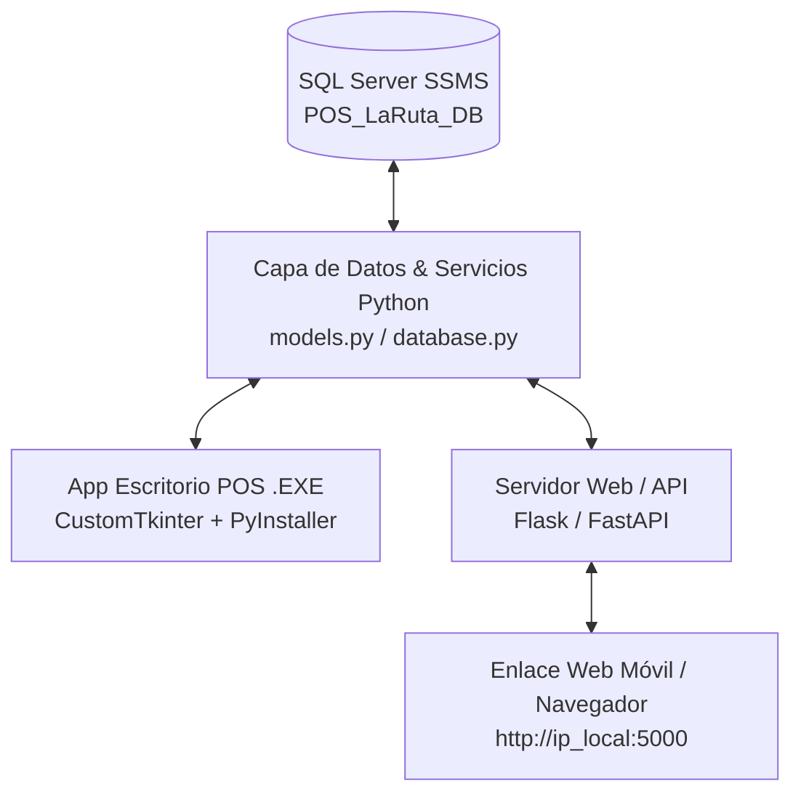

# Plan de Implementación: Sistema POS & Control de Inventarios (SQL Server + Dual Desktop/Web)
**Caso Ficticio**: Minimarket La Ruta del Este, S.R.L. (Santo Domingo Este, R.D.)  
**Asignatura**: Proyecto Integrador I (INF-225-002) - UTESA  
**Tecnología**: 
- **Backend / BD**: Python + Microsoft SQL Server (SSMS via `pyodbc`)
- **App Escritorio (Caja/Cajeros)**: `CustomTkinter` -> Empaquetado a `.exe` independiente con `PyInstaller`.
- **Servidor / Acceso Web (Pedidos WhatsApp & Móvil)**: `Flask` / `FastAPI` (Permite ingresar desde cualquier navegador o teléfono mediante enlace local o red).  
**Ubicación del Proyecto**: `C:\Users\Luis\Documents\Anti-POS_Project`

---

## 📌 1. Resumen del Proyecto y Contexto del Cliente

El **Minimarket La Ruta del Este, S.R.L.** requiere un sistema que resuelva:
- Descuadre del 14% de inventario.
- Pérdidas de RD$18,700/mes por productos vencidos y compras urgentes.
- Cancelaciones de pedidos por WhatsApp (consulta de stock lenta).

### Solución Dual (Desktop + Web):
1. **Aplicación Desktop (.EXE)**: Para la computadora física de la caja/POS. Ultra rápida, ligera, creada con `CustomTkinter` y empaquetada con **PyInstaller** en un ejecutable ejecutable en cualquier PC con Windows sin requerir instalación previa de Python.
2. **Plataforma Web (Enlace Web)**: Servidor web integrado (Flask/FastAPI) que permite a los encargados de despacho por WhatsApp, administradores o clientes consultar el stock en tiempo real y hacer pedidos desde cualquier teléfono celular o laptop ingresando a un enlace web (ej: `http://localhost:5000` o IP en red local).

ambas aplicaciones comparten la **misma base de datos centralizada en SQL Server (SSMS)**.

---

## 🏗️ 2. Arquitectura de Distribución



---

## 📦 3. Empaquetado a Ejecutable (.EXE con PyInstaller)

Se incluirá un script de compilación `build_exe.py` y una configuración especificada para **PyInstaller**:

```bash
# Comando de compilación PyInstaller
pyinstaller --noconfirm --onedir --windowed --name "POS_LaRuta_Este" --icon=assets/icon.ico main.py
```
- **Resultado**: Una carpeta o ejecutable `.exe` en `dist/POS_LaRuta_Este.exe` para distribución directa a la PC de la tienda.

---

## 🌐 4. Módulo de Acceso Web mediante Enlace

Se construirá una aplicación web liviana dentro del proyecto (`web_app.py` / carpeta `templates/` y `static/`):
- **Consulta de Stock para Pedidos WhatsApp**: El personal de WhatsApp entra a `http://<IP_Servidor>:5000/whatsapp` desde su smartphone para verificar si un producto está disponible en segundos.
- **Alertas de Stock en la Web**: Vista gerencial de productos agotados y por vencer.
- **Acceso mediante enlace o código QR**: Cualquier dispositivo conectado a la red local Wi-Fi de la tienda puede acceder escaneando un código QR o abriendo el enlace en el navegador.

---

## 🗄️ 5. Modelo de Base de Datos en SQL Server (SSMS)

Se utilizará el script T-SQL `Script_BaseDeDatos_SSMS.sql` ya generado en `C:\Users\Luis\Documents\Anti-POS_Project\Script_BaseDeDatos_SSMS.sql`.

---

## 📋 6. Plan de Ejecución Fase a Fase

- [x] **Fase 1**: Análisis y diseño de la arquitectura Dual (Desktop .EXE + Web Enlace + SQL Server) - (Completado).
- [ ] **Fase 2**: Verificación/Conexión con SQL Server en SSMS (`POS_LaRuta_DB`).
- [ ] **Fase 3**: Desarrollo del Backend Centralizado en Python (`database.py`, `models.py`, `services.py`).
- [ ] **Fase 4**: Desarrollo de la App de Escritorio en `CustomTkinter` (POS, Inventario, Caja).
- [ ] **Fase 5**: Desarrollo del Portal Web en `Flask` para acceso por enlace (Consulta WhatsApp, Reportes, Catálogo Móvil).
- [ ] **Fase 6**: Empaquetado con `PyInstaller` para generar el archivo `.exe` ejecutable.
- [ ] **Fase 7**: Pruebas de integración simultánea (Venta en App Desktop -> Reflejo instantáneo en el Portal Web).

---

## 🧪 Plan de Verificación y Pruebas

1. **Prueba del Ejecutable `.exe`**: Ejecutar la app generada por PyInstaller en una máquina de prueba sin Python instalado y validar su funcionamiento.
2. **Prueba de Enlace Web**: Abrir el navegador en un smartphone o laptop secundario mediante el enlace `http://<IP>:5000` y realizar una consulta de producto.
3. **Sincronización Dual**: Vender un artículo desde la app `.exe` de Caja y verificar inmediatamente desde el enlace web que el stock haya disminuido.
